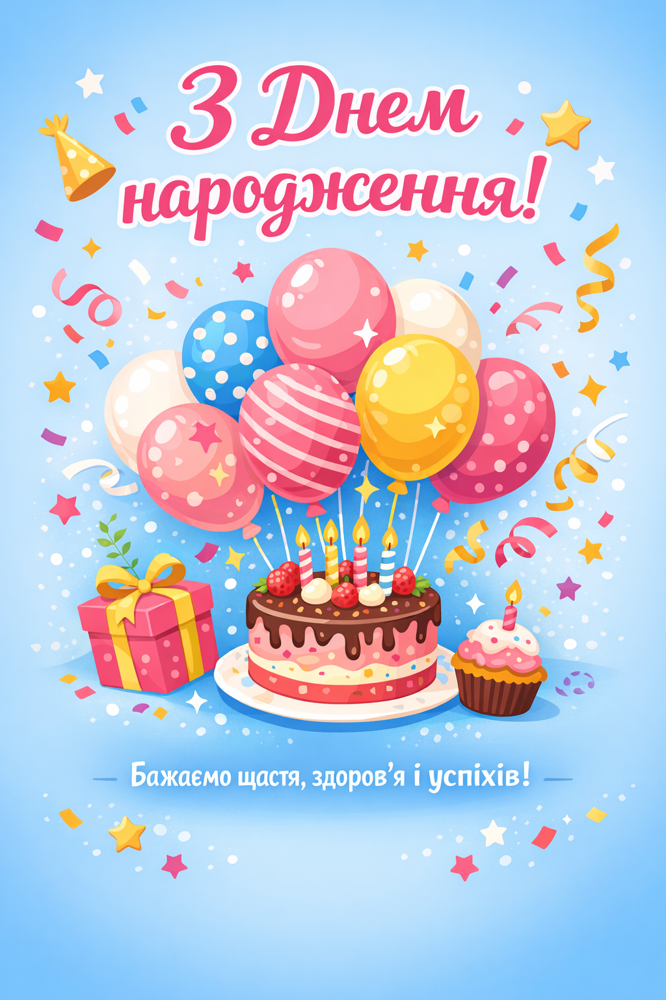

# 🖌 Завдання: Створення листівки в Canva

## Тема завдання
**«Привітальна листівка»**  
(можна обрати свято чи подію: День народження, 8 Березня, Новий рік тощо).

---

## Крок 1. Вхід у Canva
1. Відкрити сайт **[Canva](https://www.canva.com)**.  
2. Увійти або зареєструватися.

---

## Крок 2. Створення нового проекту
1. Натиснути **«Створити дизайн» → «Листівка»** (розмір стандартний A5 або A6).  
2. Обрати **пустий шаблон** або готовий шаблон, який підходить за темою.

---

## Крок 3. Вибір композиції
- Використати **центрову композицію** для головного елемента (картинка, фото, ілюстрація).  
- Додати **декоративні елементи**: рамки, геометричні фігури, орнаменти.  
- Спробувати **контрастні кольори**, щоб акцент був на головному зображенні.

---

## Крок 4. Додавання тексту
1. Натиснути **«Текст» → «Додати заголовок»** для головного привітання.  
2. Додати підзаголовок або побажання меншим шрифтом.  
3. Використати **не більше 2–3 шрифтів**, щоб листівка була гармонійною.  
4. Перевірити **читабельність**: шрифт повинен добре виділятися на фоні.

---

## Крок 5. Додавання графічних елементів
- Ілюстрації (через **«Елементи» → «Ілюстрації»**)  
- Фото (через **«Фотографії»**)  
- Рамки, тіні, геометричні фігури

---

## Крок 6. Перевірка балансу
- Подивитися на листівку в цілому: чи все гармонійно?  
- Чи головний елемент виділяється?  
- Чи легко читається текст?

---

## Крок 7. Завершення та збереження
1. Натиснути **«Завантажити» → PNG або PDF**.  
2. Зберегти готову листівку на комп’ютер.

---

## ✅ Порада для учнів
- Використовуйте **кольорову гармонію** (3–4 кольори максимум).  
- Для колажу можна поєднувати **фото + ілюстрації + текст**.  
- Головне — **естетичність і читабельність**.

# 🖌 Приклад листівки в Canva

> Це приклад привітальної листівки з тортиком, кульками та конфетті.  
> Використовуйте його як орієнтир при створенні власної листівки в Canva.
